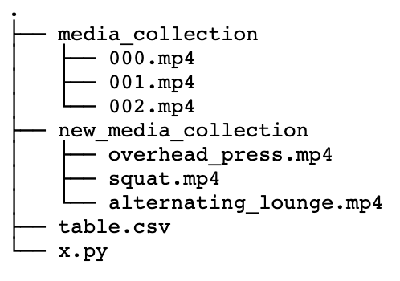

 1.13.20
 Bulk Rename Video Files According to CSV

 we have the task of naming video files according to their identifier  
 for example a video named 0000.mp4 needs to be named overhead_press.mp4  
 or a video named 0001.mp4 needs to be named squat.mp4  

 assume the initial directory structure below,  
 where the unnamed media is contained in './media_collection/',  
 where there is an empty directory named './new_media_collection' which is the target for the renamed files  

 

 the table.csv file maps the old file identifiers to the new ones  
 for each file/row in column A there is an absolute path to the video file yet to be named  
   for example : /home/claybeard/code/rename_videos/media_collection/000.mp4  
 for each file/row in column B there is a new identifier for each filename that is space separated  
   for example : 'bench press'  
   for example : 'squat'  

 running this script, x.py, will copy the file contents of media_collection and rename them according to the map defined in table.csv, the output looks something like the structure below :  

 

run the script with a command line parameter to add a prefix to the output csv file
$ python3 x.py fb
